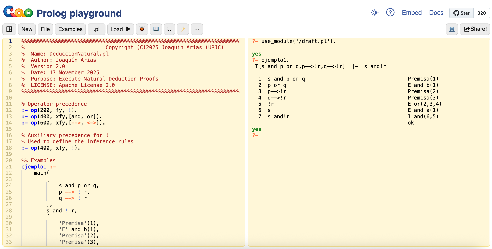
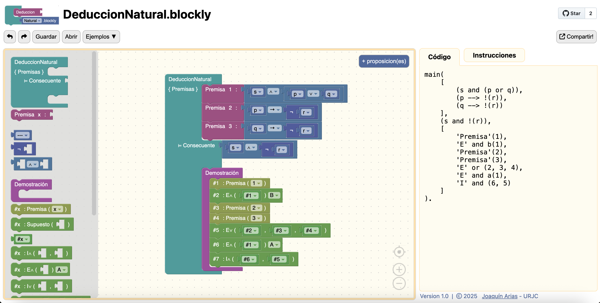

# DeduccionNatural[.pl, .blockly]

## Introducción

DeduccionNatural es un proyecto de innovación educativa (desarrollado
por [Joaquín Arias](http://www.ia.urjc.es/GIA/joaquin-arias/) - URJC)
para la construcción y comprobación de demostraciones de argumentos en
lógica proposicional (y lógica de primer orden) usando Deducción
Natural.

Para iniciarte en la deducción natural, es útil revisar una referencia
introductoria. Los Apuntes de [Lógica: desde Aristóteles hasta
Prolog](https://burjcdigital.urjc.es/bitstream/handle/10115/20014/Lo%cc%81gica-apuntes.pdf?sequence=19&isAllowed=y)
de Joaquín Arias (2023) ofrecen una explicación clara y progresiva,
ideal para comprender los fundamentos que luego aplicarás en
Blockly. Dedicar unos minutos al tema 2 ayudará a situarte y entender
mejor el sistema.

En estos momentos el proyecto cuenta con dos módulos:

* [DeduccionNatural.pl](DeduccionNatural.pl): programa escrito en Ciao
  Prolog [https://ciao-lang.org/](https://ciao-lang.org/) para
  comprobar si la demostración de una Deducción Natural es correcta.

* [DeduccionNatural.blockly](DeduccionNatural.blockly): pagina web
  escrita usando Blockly by Google
  [https://developers.google.com/blockly](https://developers.google.com/blockly)
  para construir las consultas a DeduccionNatural.pl usando bloques.

  * Dependencias: {[logo.png](logo.png), [examples.js](examples.js)}.                                                        

http://platon.etsii.urjc.es/~jarias/DN/DeduccionNatural.blockly/

### DeduccionNatural.pl

Ejecutar visitando la pagina
[http://platon.etsii.urjc.es/~jarias/DN/DeduccionNatural.pl/](http://platon.etsii.urjc.es/~jarias/DN/DeduccionNatural.pl/).

Se trata de un programa auto-contenido, embebido en el playground de
Ciao, en el que se puede comprobar la demostración de diversos
ejemplos. Para ello hay que escribir la consulta correspondiente en el
top-level (panel de la derecha), p.ej., para ejecutar el ejemplo 1:

```
?- ejemplo1.
```

El resultado esperado de la ejecución, usando el Playground de Ciao,
se muestra en la siguiente captura de pantalla.
[](http://platon.etsii.urjc.es/~jarias/DN/DeduccionNatural.pl/)

### DeduccionNatural.blockly

Ejecutar visitando la pagina
[http://platon.etsii.urjc.es/~jarias/DN/DeduccionNatural.blockly/](http://platon.etsii.urjc.es/~jarias/DN/DeduccionNatural.blockly/).

Se trata de una pagina web con solo dos dependencias (el logo y un
archivo con los ejemplos/ejercicios), en el que se pueden construir
las consultas para DeduccionNatural.pl usando los bloques de Blockly
by Google.. Para ello empieza revisando los ejemplos y, después,
avanza a los ejercicios ordenados por dificultad: básico, medio y
avanzado, p.ej., el ejemplo 1 se muestra en la siguiente captura de pantalla.
[](http://platon.etsii.urjc.es/~jarias/DN/DeduccionNatural.blockly/)

## Tutoriales

DeduccionNatural[.pl, .blockly] se ha ido desarrollando como parte de
la asignatura de Lógica en la Escuela Técnica Superior de Ingeniería
Informática de la Universidad Rey Juan Carlos desde el curso
2022/2023.

* El manual de uso de DeduccionNatural.pl y videos tutoriales (creados
por Iván Rámirez) están disponibles en las carpetas correspondientes
{[Manual](Manual), [Videos](Videos)}, en la biblioteca digital de la
URJC
{[https://burjcdigital.urjc.es/](https://burjcdigital.urjc.es/handle/10115/20168)},
o para mayor facilidad en los siguientes enlaces de YouTube.com:

  * [Tutorial 1](https://youtu.be/gpWFFFUTHX0)
  * [Tutorial 2](https://youtu.be/G7i55ub4dW0)
  * [Tutorial 3](https://youtu.be/K1clmokaOsY)

* En breve esperamos poder disponer del manual de uso de
DeduccionNatural.blockly y videos tutoriales.

## Licencias

El código tiene licencia Apache License 2.0.


