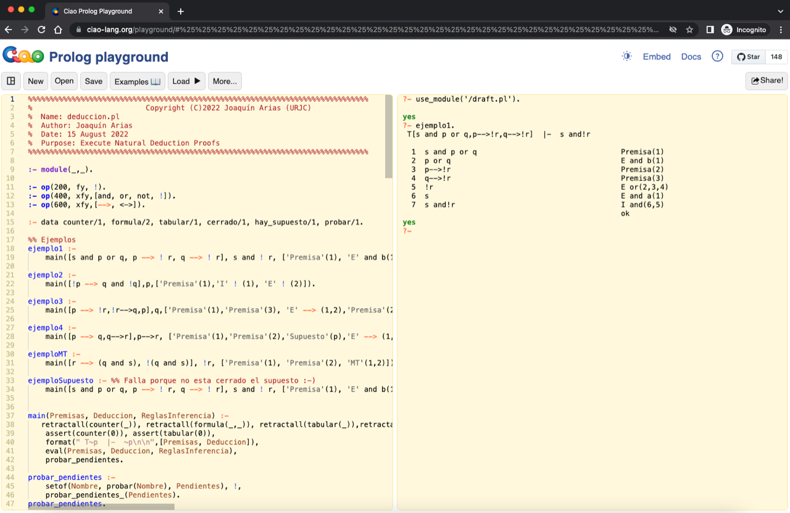

# DeduccionNatural

## Introducción

Programa escrito en Prolog para comprobar si la demostración de una Deducción Natural es correcta.

### Autores

Iván Ramírez Díaz.

Joaquín Arias.

### Contenido del repositorio

* En la carpeta ```Code``` se encuentra el codigo.
* En la carpeta ```Manual``` se encuentra el manual.
* En la carpeta ```Ejemplos``` se encuentran ejemplos.

## Primeros pasos

Ejecución de DeduccionNatural.pl en el Playground de Ciao (online, no requiere instalación):

[Follow this link](https://tinyurl.com/deduccionnatural22)

Se trata de un programa Prolog, para observar el resultado de algunos ejemplos, escribir la consulta correspondiente en el top-level del Playground de Ciao:

```
?- ejemplo1.
```

El resultado esperado se muestra en la siguiente captura de pantallas.




## Licencias

El código tiene licencia Apache License 2.0. (ver Code/LICENSE.md)

El manual tiene licencia CC BY-SA 4.0. (ver Manual/LICENSE.md)

