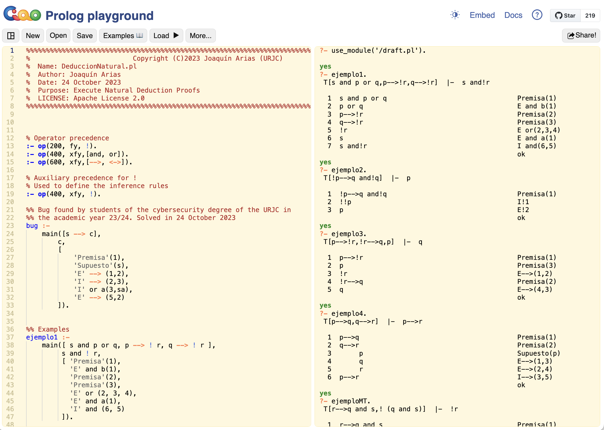

# DeduccionNatural.pl
## Introducción
DeduccionNatural.pl es un programa escrito en Ciao Prolog [https://ciao-lang.org/](https://ciao-lang.org/) para comprobar si la demostración de una Deducción Natural es correcta.
 * Código escrito por: Joaquín Arias.
 * Videos tutoriales realizados por: Iván Ramírez Díaz.
## Código
El programa está autocontenido un un archivo prolog llamado DeduccionNatural.pl.
Para su ejecución se puede instalar Ciao Prolog de modo local (visitar [https://ciao-lang.org/](https://ciao-lang.org/)) o utilizar el playground online siguiendo el siguiente enlace: [https://tinyurl.com/deduccionnatural22](https://tinyurl.com/deduccionnatural22)
Se trata de un programa Prolog, para observar el resultado de algunos ejemplos, escribir la consulta correspondiente:
```
?- ejemplo1.
```
El resultado esperado de la ejecución, usando el Playground de Ciao, se muestra en la siguiente captura de pantalla.

## Tutoriales
Este programa se ha desarrollado como parte de la asignatura de Lógica en la Escuela Técnica Superior de Ingeniería Informática de la Universidad Rey Juan Carlos.
Los apuntes de la asignatura, manual de uso del programa y videos tutoriales están disponibles en la biblioteca digital de la URJC ([https://burjcdigital.urjc.es/](https://burjcdigital.urjc.es/)).

## Licencias
El código tiene licencia Apache License 2.0.


